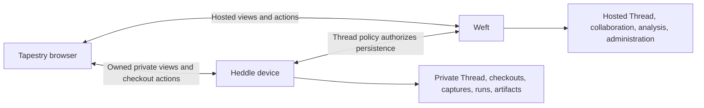

# Candidate v2 streams and client integration

`heddle.api.v2alpha1` is a clean alpha cutover contract. Consumers switch to its
native routes together; no v2 route forwards a legacy RPC request or response.
It implements generated types, typed clients, shared framing, and observation
lifecycle validation. Every v2 service is **PLANNED**: this repository does not
implement Weft/Heddle handlers, portable root verification, or an Iroh adapter.
The [design](design.md) records the complete target; this document defines the
candidate streaming behavior and identifies the remaining cutover decisions.

## Endpoint and service boundaries



Tapestry talks directly to both endpoints. Its reducer combines observations by
stable Thread identity and keeps each source's version, tip, availability and
checkouts. Weft independently serves published review, approval and landing.
Device actions identify the checkout and device explicitly. A relay carries
transport bytes; it is not the authority or an application proxy.

| Surface | Shape | Purpose |
| --- | --- | --- |
| Endpoint | DescribeEndpoint unary, reusable during connection setup | Implemented handlers, protocol formats, budgets |
| Workspace / Thread / Spool | Observe server streams | Bounded initial worklist or page, then updates |
| Collaboration / Analysis / Run | Observe server streams | Typed detail, freshness, progress and history |
| Identity / Attention / Notification / Operation | Observe server streams | Account state and background changes |
| Content / Search | Finite server streams | Batched exact-revision selections and bounded results |
| Mutations | Typed unary request and receipt | Exact targets, versions, operation identity and recovery |
| Sync | Live ReplicateThread, bounded PublishContent/Fetch and streamed provider extents | Thread-bound pack, provider and sidecar transfer |
| Integrations | Observe plus typed connection/import/sync commands | Provider setup, repositories and remote links |

One logical RPC uses one reliable, ordered Iroh stream. Reuse the authenticated
connection for many RPCs. Send the opening request before awaiting a response;
Iroh stream creation is lazy. This follows the [official protocol guidance](https://docs.iroh.computer/protocols/writing-a-protocol).
Keep `heddle-api/1` framing: the fully qualified method path selects the protobuf
package. Adding a package does not itself change the transport ALPN.

An open Thread page normally needs one `ObserveThread` per participating source,
with the selected review/context/analysis sections, independent of the number of
visible records. Lists contain useful overviews rather than IDs requiring a read
per row. Source expansions use batched `ReadContent` selections. More pages and
large artifacts are explicit reads. This is a contract budget, not a measured
call-count or server-capacity claim; integration must measure initial render,
queries, bytes, buffering and slow consumers under thousands of streams.

## Observation state machine

Each Observe event has a `StreamFrame` and a method-specific payload oneof.
Sequence starts at 1 for each stream and increases by one, including controls.
Only Data has a payload. Unknown control/data kinds, missing required payloads,
wrong sequences and invalid phase transitions are protocol failures.

```text
new:    Open → Snapshot data* → Checkpoint(snapshot_complete=true)
follow:                    → (Upsert/Remove data* → Checkpoint)*
resume: Open(resumed_from=last committed cursor) → follow
once:   new or replay to a fixed watermark → Complete → FIN
reset:  Reset → FIN; discard staged data and start a new snapshot
```

The endpoint must establish snapshot/update continuity before reading the
snapshot (transaction watermark plus retained changes, or equivalent). No update
may disappear between the two. A snapshot is bounded, stages off-screen, and
becomes visible atomically at its first checkpoint. Later checkpoints commit
bounded delta batches. A client persists a cursor atomically with the view it
identifies, never before applying that batch. On interruption it discards staged
data and resumes from its last committed cursor. Replay may repeat record values;
reducers use stable keys and exact versions, not append-on-arrival semantics.

A checkpoint has a nonempty cursor of at most 4096 bytes, different from the last
cursor, with `previous_cursor` equal to that last cursor (empty for the first
snapshot). Even an empty snapshot needs a checkpoint. Heartbeats do not advance
cursors. Complete is valid only after a committed boundary, with no pending data,
and names that boundary's cursor. FIN alone is interruption, never proof of a
complete snapshot or empty collection. Reset is terminal and can reject a cursor
before Open; retaining an old rendered view requires marking it stale.

Open identifies the authenticated source, effective budget, authority expiry and
a 32-byte opaque binding digest. Clients verify source against their connection,
retain the initial digest with the normalized request, and require the same
binding on resume. The endpoint binds cursors to its identity, method, schema,
normalized query/sections/order/page window, caller scope and authorization epoch.
Cursors are not bearer capabilities, publication receipts, or pagination tokens.
The server validates them under current authority on every reconnect. Changing a
query starts a new snapshot. An unresumable cursor produces explicit Reset, never
silent replacement. Binding construction is endpoint-owned and versioned;
clients do not hash arbitrary protobuf bytes to derive it.

FOLLOW is the Observe default. ONCE takes a snapshot or replays to a fixed
watermark and ends; it supports clients that cannot hold subscriptions. Finite
ReadContent/ReadArtifact/Search streams have typed completion records instead of
the observation envelope. Every selection must complete, with coverage and page
information; missing completion is interruption. Empty and unavailable differ.
No live Thread tip is silently substituted for an exact RevisionRef, which can
name native state or an exact Git commit.

Tree selections return `ContentTreeEntry` with an explicit target. Native file
and tree hashes, Git object IDs, and child-spool identities plus anchored StateIds
remain distinct. Following a symlink, Git link, or child spool is a separate
operation; the containing revision does not grant access to a linked resource.
File size has presence, so an unknown length differs from a known empty file.

Tree paths are repository-relative, including the selected subtree prefix.
Depth zero requests one level. Pagination preserves component order (a directory
and its descendants precede its next sibling), and its token binds revision,
subtree and depth. A completed page can carry a continuation: only `exhausted`
means there are no more matching entries. A byte budget should shorten the page
and return a usable continuation whenever an entry and completion can fit.

## Views, paging and bounded work

Filters define an endpoint-local window, with deterministic order and stable ID
as a tie breaker. Zero size selects a bounded default. Page tokens bind the
query and snapshot; they are distinct from change cursors. Each composed section
reports its own coverage and pagination. Not requested, pending, partial, stale,
unavailable and complete have different meanings. Unavailable data must not be
reported as an empty successful collection.

Upsert replaces a keyed record. Remove evicts a record from this observed window;
it does not claim physical purge. A SectionReplacement stages clearing the named
section followed by its replacement records within one checkpoint batch. Use it
for head-dependent diffs/evidence and sections whose legacy records lack stable
keys. Section names are lower-case enum suffixes, e.g. `review`, `collaboration`,
`threads`, `invitations`; content status uses the request's selection_id. Identity
uses `identity`, `devices`, `sessions`, `signup_invitations`. Workspace uses
`spools`, `threads`, `attention`, `operations`, `devices`.

A window change must produce complete membership updates or an explicit
WINDOW_CHANGED Reset. Never silently drop an event to keep a consumer current.
A view has one consistency boundary per endpoint, not a distributed transaction
across Weft and every device. Browser composition preserves source provenance.

RPC metadata declares `live_stream` independently of retry behavior. Observe
methods and Thread replication allow quiet intervals between complete messages.
Finite content reads and source transfers retain operation-progress deadlines,
including transfers that can resume. Every stream still bounds its initial
response and incomplete frames. A canceled read preserves both partial framing
and its original deadline; reconnecting is distinct from restarting that timer.

Endpoints advertise positive default and maximum item/frame/snapshot/batch limits.
Accepted budgets cannot exceed either the requested nonzero limit or endpoint
maximum. The shared codec ceiling is 8 MiB per control message; endpoints should
choose smaller limits for interactive views. The cursor ceiling is 4096 bytes.
Enforce frame lengths before allocating the declared body. Transports and typed
reducers additionally enforce total snapshot/batch/item limits; the lifecycle
tracker alone does not bound domain data. Bound queues, active subscriptions,
server queries and serialization work separately from QUIC stream count.

Propagate transport backpressure into production. A subscriber that exceeds
retained history or pending batch limits gets SLOW_CONSUMER Reset or a typed
failure if Reset cannot be delivered. Do not retain an unbounded queue while
waiting to send Reset. Reconstruct from durable watermarks/shared change feeds;
do not assume one database transaction or polling task per idle view is cheap.

## Authority, privacy and mutation recovery

Method metadata describes baseline request targets; it is not the entire guard.
A composed view authorizes each section, record and nested target before emitting
bytes. Spool membership read does not authorize invitation secrets, grants or
administration sections. Apply the corresponding administration guard
and redaction rules; report unavailable only when even that disclosure is allowed.
Inspect every nested scope, not only the outer spool selector.

Hosted passkey sign-in uses `BeginAuthentication` and `CompleteAuthentication`.
The challenge records the existing caller device key; completion proves that
key with `CallContext.request_proof` over the exact request and separately
verifies the passkey assertion against its credential owner and `user_handle`.
An account hint constrains the credential owner even when no account was found.
Challenges and credential IDs are raw bytes on the wire; WebAuthn client data
encodes the challenge as base64url without padding. Sign-in never enrolls an
attachment or promotes the account's rooting tier. Challenge consumption,
authenticator-counter advancement, session creation and operation completion
commit atomically. Retries may retain public client-owned session metadata;
owner bundles containing a subject Biscuit must be retrieved separately after
successful authentication and excluded from that replay body.

Session records include the metadata required to render an active-session
page within `ObserveIdentity`. Their opaque versions identify persisted
authorization state and remain usable across serving endpoints and viewers.
`RevokeSession` requires that exact version and changes only the selected
session. A delegated credential may end its own session; ending a different
session requires the account's independent-root authority. Device-key and
delegation revocation remain separate operations. Device enrollment can omit
the handle: the authenticated account UUID selects the existing account.

Owned-device access first verifies the caller and device attach to the same
user root, then applies attenuation, resource/action scope and private-facet
rules. Hosted account membership is not a substitute for this check. A browser
may be directly attached to the user root; it need not obtain authority from
Weft. No credential secret or root private key is serialized into a view. This
candidate does **not** supply the root attachment format or verifier. An endpoint
must not enable private device routes before those checks exist and pass offline
and wrong-root tests. The capability-advertisement boolean alone grants nothing.

Raw forensic artifact access requires the owned-device proof and applicable
artifact/disclosure scope; a generic resource-reader grant is insufficient.
Reading to the owner's browser does not persist to Weft. Hosted copies require
separate explicit consent. Runtime secret values remain behind the execution
broker, outside general artifact/source reads. Thread sharing policy governs
ongoing approved source/collaboration/evidence/scrubbed timeline sync; it does
not include raw/runtime objects transitively through a pack closure.

Authority expiry ends a stream. Revocation or narrowed authority observed by an
endpoint stops affected delivery and invalidates its cursor scope. Offline device
verification cannot know an unseen revocation; its proof freshness policy must
say what it accepts. Reconnect with fresh proof; do not widen a live stream's
scope. Discovery reports implemented methods, while view action metadata keeps
implementation, authorization and readiness separate. Every mutation rechecks
its actual inputs and versions even if its earlier preview said ready.

Mutation IDs are scoped by endpoint, authenticated principal and canonical
method. Dedup records bind the exact request digest and outcome. Reusing an ID
with different bytes fails. Persistence of the dedup record and effect must be
atomic or durably recoverable before acknowledgement. The endpoint advertises
retention; after expiry it cannot promise safe replay. An ambiguous reply is
reconciled through ObserveOperations with the original ID before any resubmission.
Local completion, background completion and publication acceptance are separate.
A signature freezes target, revisions, policy version, operation ID and expiry;
a signer never approves a mutable selector that is re-resolved afterward.

Canceling a subscription only stops delivery. CancelOperation is an explicit
request; acknowledgement is not rollback or proof work was canceled. Clients
must not redirect a mutation to another endpoint or retry an ambiguous write
automatically. Typed failures continue using v1 CallFailure/ErrorDetail.

## Companion clients

Rust exposes messages at `heddle_api::heddle::api::v2alpha1`, the separate catalog
at `heddle_api::v2::ALL_METHODS`, and typed markers at `heddle_api::v2::rpc`.
`v2::client::Client` supports typed unary/observe/duplex methods over caller-owned
`RpcTransport`. Native adapter futures are Send; no executor, socket, signer or
heap-boxed dispatch is imposed. Dropping a live Messages cancels observation;
dropping an unfinished Sender aborts its send half. Duplex halves can be driven
independently. The adapter owns deadlines, authentication, exact-byte signing,
framing and cancellation while opening a call.

TypeScript exports `@heddleco/api/v2`, `/v2/client`, `/v2/observation` and the
existing `/framing`. For example, given an authenticated transport and negotiated
endpoint information:

```ts
import { ThreadService, createServiceClient } from '@heddleco/api/v2';

const threads = createServiceClient(
  ThreadService, transport, new Set(endpoint.implementedMethods),
);
for await (const event of threads.observeThread({ thread, sections }, { signal })) {
  await view.consume(event); // validates frame and atomically commits checkpoints
}
```

The typed client decodes messages; it does not silently attach a domain reducer.
Both runtimes provide ObservationState.accept/apply for shared lifecycle checks.
The apply callback must stage typed records, enforce budgets, validate payload
kind/removal/section identity, and atomically persist committed data plus cursor.
Failed callbacks do not advance the tracker, but callbacks themselves must be
transactional or idempotent. On interrupted iteration discard staged data; inspect
is_complete/isComplete before treating a finite observation as finished.

The TypeScript async iterators pull on demand and propagate early return to the
adapter. decodeMessageStream incrementally consumes arbitrarily split network
chunks, limits the declared frame before body allocation and closes its source
iterator on cancellation/error. It supports message/failure frames. Native v2 pack transfers use bounded
PackChunk protobufs and never buffer a whole pack into a message. Both languages
share framing fixtures; the existing raw-body codec remains a transport primitive.

Tool selection uses protobuf descriptors plus the intersection of the task's
chosen routes and endpoint implemented methods. It does not publish all RPCs to
every agent or invent an independent untyped Execute API. Application adapters
still supply task-specific presentation, permissions and result reduction.

## Remaining decisions and delivery gates

The [184-method v1 inventory](v1-inventory.json), [review dispositions](v1-disposition.csv)
and [native cutover map](cutover-map.csv) identify where existing functionality
lands. The clean contract has 108 native routes across 18 services. All RPC input
and output messages belong to v2; descriptor checks reject legacy RPC bridges.
Data-only source values, contract metadata and the typed failure vocabulary reuse
existing schema definitions where their semantics are unchanged. They provide no
compatibility route or fallback handler. The v1 package remains in this review
branch to check existing fixtures; consumer deployment is a coordinated cutover.

ReplicateThread is the live durable exchange. Its authenticated opening binds
Thread identity, selected facets, sharing policy, negotiated record formats and
byte/item budgets. Both peers send Have, Need, Operations and Receipt frames.
Causal parents are content-addressed operation IDs. Reconnection exchanges
frontiers and repairs missing ancestry; duplicate delivery has no new effect.
The stream remains open after catching up and delivers subsequent operations.
The finite Publish RPC is removed; there is no migration bridge.

A receipt distinguishes accepted, pending and rejected records. Accepted means
the canonical operation and its validated causal closure are durable. Receiving
bytes, storing a pending child, and having every source blob are different facts.
Missing source objects remain explicit. Rejected local work is retained locally.
An observation cursor and a transfer checkpoint are never causal frontiers.
Each frame and list obeys negotiated bounds; large frontiers and operation sets
are sent in bounded pages. Implementations must bound queued work and reconnect
from durable state after lag, rather than buffering an unbounded history.

Source and discussion histories have independent causal closure. Exporting one
facet cannot force disclosure of an excluded facet or a private parent Thread.
Changing policy or losing authority must stop further unauthorized export, even
on an already-open stream. The receiver independently authorizes admission;
valid signatures alone do not grant spool membership. A Thread view preserves
all source heads; source integration adds a capture with the selected parents.

Fetch remains a bounded source/object transfer and may propose a provider plan.
The client approves the exact digest and extents before redemption. Tickets bind
provider, principal, scope, plan and extent. Pack chunks are bounded and verified
before object installation. Source, sidecar and owner-purge authority retain
their independent checks. Bulk transfer should use separate Iroh streams so
large source objects do not delay discussion or observation updates.

StartThread accepts the same creator-signed genesis record as ReplicateThread.
The request carries its authorized spool and operation ID; descriptive inputs
are encoded once in the canonical record. Creation does not use expected-version
checks against a mutable resource. The receiving endpoint derives identity and
retains the original record; retrying the same genesis cannot mint another Thread.
Clients use the negotiated native record encoder before asking their key to sign.

The native `heddle-thread-genesis-v1` encoder and verifier live in Heddle's portable
object-model/crypto crates. Its spool is a canonical non-nil UUID, never a mutable
namespace/name address. `tests/fixtures/thread-genesis-v1.txt` is shared with the
Heddle SDK: Rust checks canonical encoding, signature and typed identity;
TypeScript checks identity, original signature and lossless protobuf relay using
the same bytes. This does not provide a TypeScript canonical genesis encoder.
A changed display
name, intent version or tip does not change identity. The creation nonce permits
distinct attempts with otherwise identical descriptive inputs. Existing UUIDs
are not reinterpreted as 32-byte hashes; clean cutover establishes new identities.

Separate checkouts may write the same Thread, including offline. One checkout
has one writer. Incoming replication never rewrites its working files. Portable
user-root attachment, canonical signed human actions and disclosure policy need
real verifiers before their routes are advertised.

Next consumer work must prove: one useful page read per source without per-row
fan-out; offline private browser access; hosted landing with devices offline;
checkout-targeted actions; scoped section/private artifact denial; gap-free
snapshot/reconnect; ambiguous operation recovery; separate local/publication
outcomes; real Iroh cancellation/backpressure and a thousands-of-stream load test.
The SDK/descriptor tests here do not replace those handler and end-to-end gates.

## First publication

`ReplicationOpen.thread_genesis` can carry the creator-signed immutable creation
record. A hosted receiver authorizes the spool, verifies the creation signature
and exact Thread identity, and commits a new replica before emitting Ready.
An existing replica must have the identical canonical genesis. Reconnecting with
the same record is idempotent and does not create another Thread. A relaying
device retains the original creator's signature and uses its own authorized
request proof for the opening. This avoids a separate hosted create request.
Acceptance of causal metadata does not assert that source-object closure is
already available; publication of those bytes has its own durable receipt.

`SyncService.PublishContent` uploads the exact source closure of an already
admitted capture. Its signed opening fixes the Thread, revision, sharing-policy
version, pack/index addresses and lengths, and operation ID. Source packs exclude
unselected context, raw transcripts, secret values, and unrelated history. The
receiver validates the complete closure before installing it and emitting a
`PublicationReceipt`. That receipt means durable content availability; only causal
replication and explicit integration determine the Thread's heads. Clients can
run these bulk streams beside the long-lived metadata exchange on one connection.

Publication openings also name the source and destination endpoint keys. Both
must match the authenticated transport; signing an opening for one receiver does
not authorize forwarding it to another receiver. Every later client frame retains
the opening's operation ID. A transport FIN does not substitute for `Finish`.

The native source transfer sends one full pack followed by its index in the
opening's inventory. Each artifact address is BLAKE3 of its entire byte stream,
including its native checksum trailer. Chunk extents retain that artifact address
and carry a contiguous offset, exact byte length, and BLAKE3 of the chunk bytes.
Full canonical tree anchors keep private historical delta bases out of the pack.

For this native profile, inventory bytes concatenate the length-delimited protobuf
encoding of each planned `PackExtent` in order. The accepted inventory uses the
native typed hash `thread-source-inventory-v1`. The plan digest uses
`thread-source-transfer-v1` over the encoded opening client frame with its
checkpoint cleared. Native typed hashes are BLAKE3 of the UTF-8 type prefix,
the content length as a little-endian u64, one zero byte, and the content bytes.
The transfer ID is the first 16 bytes of the plan digest.

A receiver that commits complete closures returns a zero-byte checkpoint until
publication commits. Interrupted scratch bytes are not durable progress. Retrying
the same operation and plan with a fresh request proof replays the committed
receipt, or restarts an uncommitted upload. The current receiver accepts that zero
checkpoint and no resume token. Clients drain responses concurrently with uploads;
their send loop cannot wait until completion to read checkpoint frames.
